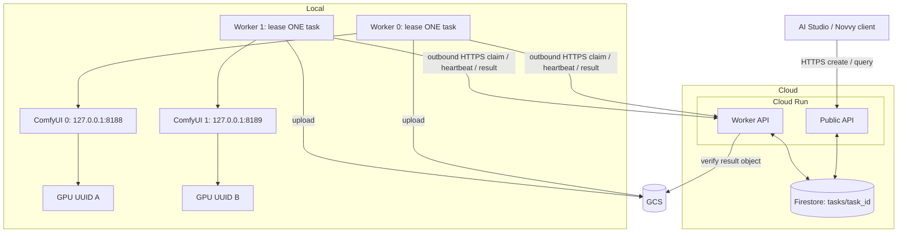

# AI Studio — MiniMax H3 API Hosting Plan V2

**Revision:** V2.4 implemented design — Cloud Run control service + local dual RTX 5090 workers  
**Date:** September 6, 2026  
**Status:** Implemented and deployed September 6, 2026. Both local GPU workers passed I2V/FL2V generation and GCS output validation using the source-derived Sage 41s workflow; see [current workflow evidence](H3_INPUTS_E2E_REPORT.md) and [initial deployment/recovery evidence](DEPLOYMENT_REPORT_LOCAL.md).  
**Repository:** https://github.com/jinxicmu/Agent-Infra  
**GCP project:** `novvy-dev`  
**Output bucket:** `self_deployed_model_working_dir`

This is the authoritative design for Codex to implement after design review. It supersedes the original RunPod deployment instructions. The supported public API contract is defined here and in the current repository schemas; historical instructions do not add requirements. The RunPod execution summary is historical evidence, not proof of the new deployment.

Historical reference only: [original V2 RunPod plan](AI_STUDIO_MINIMAX_H3_API_HOSTING_PLAN_V2_ORIGINAL_RUNPOD.md).

## 1. Required outcome and boundaries

Cloud Run receives client requests, validates them, owns scheduling and task status, and returns results to clients. The workstation initiates all communication with the cloud. Each of its two RTX 5090 GPUs runs one complete task independently, including its own full model execution. No tensor parallelism, model sharding, shared render, cross-GPU handoff, or local prefetch is used.

Each worker polls Cloud Run every **1 second while idle**. During an active task, it sends progress/lease renewal every **1 second**. Requests are bounded and never overlap within one worker's polling loop; network errors can extend the interval. A separate control loop keeps lease renewal independent of image download, GPU execution, and output upload.

Local networking follows the approved architecture: no client-facing API, reverse tunnel, port forwarding, or LAN/public listener. Each ComfyUI instance binds to **127.0.0.1 only**. Each local worker is an outbound-only process and opens no HTTP listening port.

This design preserves the asynchronous client model: create returns a task ID promptly; the client queries Cloud Run for completion. Cloud Run does not hold the original request open for an entire render. Callbacks remain unsupported.

## 2. Architecture



One Cloud Run service hosts two separate API routers: **Public API** for clients and **Worker API** for authenticated local workers. Both access the same Firestore task documents. Public endpoints never invoke ComfyUI. Worker endpoints own claim, lease renewal and result publication. The service opens no connection to either workstation GPU.

Queue membership is represented directly by each task's `status` and `mode`. A task with `status = queued` is waiting; changing it to `leased` atomically removes it from the pending query. There is no queue-control document, task-ID array, enqueue sequence, separate queue collection, or in-memory authoritative queue.

```text
Firestore tasks/{task_id}
    ├── status=queued, mode=realtime
    ├── status=queued, mode=batch
    ├── status=leased
    ├── status=running / uploading
    └── status=succeeded / failed
```

Claim requests drive scheduling. Cloud Run instances can be replaced or scaled because durable task and lease state lives in Firestore. The existing once-per-minute authenticated lease sweep remains an operational maintenance trigger; it is not another queue or dispatcher.

## 3. Responsibilities

| Component | Responsibility |
| --- | --- |
| Cloud Run Public API | Client authentication, input validation, idempotent task creation and client queries |
| Cloud Run Worker API | Worker authentication, task selection, exclusive claims, lease renewal, terminal status and result verification |
| Firestore | Task documents whose fields encode queue membership, ordering, ownership, leases and results; auxiliary worker guards and idempotency records |
| Local worker | Claim one task, persist execution journal, prepare inputs, build approved graph, execute on its ComfyUI, validate MP4, upload it, report success/failure |
| Per-GPU ComfyUI | Execute one approved task at a time on its assigned GPU |
| GCS | Durable outputs; local paths are never returned to clients |
| Cloud Scheduler | Invoke the expired-lease sweep every minute; it does not dispatch renders |

Workers have no direct Firestore access. The cloud never calls the workstation. Images and generated video bytes do not pass through Cloud Run; workers fetch approved input URLs and upload directly to GCS.

## 4. Two independent GPU execution units

| Setting | Worker 0 | Worker 1 |
| --- | --- | --- |
| Stable worker ID | `local-5090-0` | `local-5090-1` |
| Physical GPU | GPU UUID discovered for GPU 0 | GPU UUID discovered for GPU 1 |
| CUDA visibility | Only that GPU UUID | Only that GPU UUID |
| ComfyUI bind | `127.0.0.1:8188` | `127.0.0.1:8189` |
| Active task limit | 1 | 1 |
| Prefetched tasks | 0 | 0 |
| Input/output/temp/journal paths | Dedicated worker-0 paths | Dedicated worker-1 paths |

GPU UUIDs are preferred over indices for stable assignment across reboots. Inside each isolated process, the selected physical GPU may appear as logical CUDA device 0. Do not combine visibility masking with an option that unintentionally selects another physical device.

Reuse the existing ComfyUI installation, Python environment, and model files where compatible; each process owns its GPU model memory and mutable directories. Share model weights on disk read-only. Launch two ComfyUI processes and two pull-worker processes under separate systemd units with restart policies. Use a per-worker filesystem lock to prevent duplicate local processes. Start workers only after their own ComfyUI is healthy and its queue is empty or reconciled with their journal.

The existing workspace launcher contains `--listen 0.0.0.0` and cannot be used unchanged for this deployment. Cutover must replace that listener with loopback binding. Do not start a second ComfyUI on GPU 0 while the current process still occupies it. Drain and deliberately replace the existing process during rollout.

Repository evidence validates FL2V on RunPod. Local runtime notes report ComfyUI 0.34.0, CUDA 13.2, SageAttention 2.2.0 and a successful single-GPU run. Matching FL2V model and LoRA files exist locally. These observations support reuse, but neither dual-GPU concurrent inference nor the repository's full FL2V API path has yet been validated locally.

## 5. API contract

Keep:

- `POST /v2/video_generation` with the existing bearer-authenticated request schema.
- `GET /v2/query/video_generation?task_id=...` with the existing task response.
- `GET /health` for public Cloud Run process liveness (`/healthz` is a container-only compatibility alias because the Google frontend intercepts it); local GPU reachability is not a Cloud Run liveness requirement.

The Sage 41s update enables `MiniMax-H3`, `i2v_first` (required first frame, omitted last frame) and `fl2v` (first and last frames), `768P`, duration `5`, ratio `16:9` (fixed 1344×768), and modes `realtime` / `batch`. Both input cases use the same source-derived graph and checkpoint. Other models/workflows remain rejected. See `API_USAGE_H3.md` for request examples and `H3_INPUTS_E2E_REPORT.md` for deployment validation.

Add an optional `Idempotency-Key` header on create. Scope it to the authenticated client identity. A repeated key with an identical normalized request returns the original task ID; a different request returns 409. The task is created with `status = queued`; task creation and the idempotency mapping commit in one transaction. No separate queue insertion is needed. Define a seven-day idempotency retention window and document that retries outside it can create a new task.

Worker-only endpoints:

| Endpoint | Behavior |
| --- | --- |
| `POST /internal/workers/recover` | Verify journal proof and a live lease; atomically bind the existing assignment to the restarted process session; return 409 after marking an expired assignment failed |
| `POST /internal/workers/claim` | Record worker presence and atomically claim the highest-priority compatible task; return the existing assignment on a retried claim; return 204 if none |
| `POST /internal/tasks/{task_id}/heartbeat` | Validate worker ownership and lease token, extend lease, record phase and ComfyUI prompt ID; return lease deadline |
| `POST /internal/tasks/{task_id}/complete` | Verify ownership and expected GCS object, then atomically mark success; identical repeats return success |
| `POST /internal/tasks/{task_id}/fail` | Record a bounded structured error and release the assignment atomically; identical repeats return success |
| `POST /internal/maintenance/expire-leases` | Scheduler-authenticated sweep of expired active assignments |

Worker requests carry a random process-session ID. A different session cannot silently take over a still-live assignment. A restarted process uses an explicit recovery request backed by its saved journal and exclusive local lock. Every task mutation carries its opaque lease token; worker identity alone is insufficient. Clients cannot invoke worker or maintenance actions.

The claim response contains the normalized request, workflow/config revision, fixed per-task random seed, task ID, lease token and deadline, and expected GCS object name. It never accepts arbitrary graph JSON from a public caller. The worker uses its installed allowlisted workflow and refuses a revision mismatch.

### 5.1 Restart recovery contract

`POST /internal/workers/recover` uses the same worker-specific bearer authentication as claim. The credential determines `worker_id`; the body cannot select another worker identity.

Required request body:

```json
{
  "task_id": "gen_example",
  "lease_token": "opaque-token-from-journal",
  "old_worker_session_id": "session-from-journal",
  "new_worker_session_id": "new-process-session"
}
```

Before sending, the restarted process acquires its exclusive local worker lock and atomically persists this recovery request, including the new session ID, in its journal. The local lock ensures only one process controls that GPU; possession of a lease token alone does not prove a process has stopped. The server verifies the credential and journal proof as follows:

1. In a Firestore transaction, read the task and matching worker assignment guard. Verify authenticated `worker_id`, task ID, lease token and old session against the retained task ownership fields (or the recorded pair for an identical recovery retry). For an active task, require the guard to reference the same task/session. For an already-terminal task, allow the guard to have been cleared or assigned to newer work; return the terminal/expiry result without modifying that guard. Verify the worker's approved workflow revision. Reject proof mismatches without changing ownership.
2. Require the task to be active (`leased`, `running` or `uploading`), its lease to be live, and its hard execution deadline not to have passed.
3. Atomically replace `worker_session_id` on the task and guard with `new_worker_session_id`. Preserve task ID, seed, workflow revision, prompt ID, phase and lease token. Renew the live lease from cloud time, capped by the original hard deadline; recovery never restarts the task deadline. Record the old/new session pair so an identical retry is recognizable.
4. Return HTTP 200 with the existing live assignment in the claim-response shape, including the newly bound session, lease token/deadline, request, seed, workflow revision and known ComfyUI prompt ID/phase. The worker journals this response and resumes reconciliation/monitoring; recovery does not submit a new render.

If the response is lost, resend the same persisted body. When the task is still live and already bound to that exact new session from that old session, return the same assignment without another ownership transfer. A different proposed new session cannot reuse the old proof after the first transfer. All subsequent mutations verify the current session, so the old process is fenced out. Test concurrent recovery calls and old-process heartbeats racing recovery.

**Expired lease:** return HTTP 409 with `WORKER_LEASE_EXPIRED`; the task must already be `failed`. If the sweep has not run, the recovery handler first commits the failure and matching guard release itself, then returns 409. Do not raise an exception that rolls back that failure transaction. Apply the same rule with `TASK_DEADLINE_EXCEEDED` when the hard deadline has passed. An already-failed expiry is an idempotent 409. No recovery revives or requeues either case. Other terminal tasks return `TASK_ALREADY_TERMINAL`; an ownership/proof mismatch returns `LEASE_CONFLICT`. Lost success acknowledgements use the completion retry contract, not recovery of a terminal task.

## 6. Task documents are the queue

### 6.1 Canonical task record

```text
tasks/{task_id}
    status                 queued | leased | running | uploading | succeeded | failed
    mode                   realtime | batch
    created_at             Firestore server timestamp, immutable

    worker_id              null until claim
    worker_session_id      null until claim
    lease_token            null until claim; opaque random token
    lease_deadline         null until claim; cloud-controlled timestamp

    seed                   fixed random seed assigned at creation
    workflow_revision      immutable approved workflow/config revision

    gcs_generation         null until verified completion
    checksum               null until verified completion; {algorithm: crc32c, value: ...}
```

The task also contains its normalized request, model/workflow type, client identity, updated/start/completion timestamps, hard execution deadline, ComfyUI prompt ID, output bucket/object/size, error and metrics. Public query responses select permitted fields; they never expose lease tokens or worker session credentials. Limit normalized requests to 64 KiB and exempt request/metadata blobs from unnecessary indexing.

### 6.2 Selection and atomic claim

Local workers call the Worker API every second. **The Worker API executes these Firestore queries on their behalf**; local workers do not connect directly to Firestore.

First:

```text
FROM tasks
WHERE mode = realtime AND status = queued
ORDER BY created_at ASC, document_id ASC
LIMIT 1
```

Only when no realtime task is available in the selection snapshot:

```text
FROM tasks
WHERE mode = batch AND status = queued
ORDER BY created_at ASC, document_id ASC
LIMIT 1
```

The document-ID tie-breaker makes ordering deterministic when creation timestamps are equal. Priority is non-preemptive and evaluated at claim selection; realtime arriving after that selection does not revoke a batch claim. Only one approved workflow revision is admitted during the initial rollout. A worker reporting another revision receives HTTP 409 `WORKFLOW_REVISION_MISMATCH` and cannot claim work; this avoids leasing an incompatible head task or silently skipping it.

A claim transaction:

1. Reads the authenticated worker's assignment guard. A repeat from the owning session returns its existing live task; a different session must use explicit recovery.
2. When the worker is unassigned, runs the priority queries within the transaction and reads the chosen task. Confirms `status = queued` and the approved revision.
3. Atomically updates that individual task to `leased` and sets `worker_id`, `worker_session_id`, `lease_token`, and `lease_deadline`, plus the hard task deadline. Updates only that worker's assignment guard in the same transaction.
4. Returns the committed assignment. Empty queues return 204. A transaction conflict retries the selection; an exhausted contention retry returns HTTP 503 `QUEUE_UNAVAILABLE`, not an empty-queue response.

All reads occur before writes. The transaction callback performs no external network calls, rendering or uploads, because Firestore can rerun it. Two workers selecting the same task cannot both commit ownership. Concurrent claims from the same worker cannot lease two different tasks because they also conflict on that worker's guard. Test both cases across independent API instances.

### 6.3 Small auxiliary records, without queue membership

- `workers/{worker_id}`: one assignment guard per GPU worker, with active task ID, session, capability revision and last-seen information. This is an ownership lock, not a waiting-task list. It prevents duplicate/retried claim calls for one GPU from acquiring multiple tasks. Task documents remain authoritative for task status and lease fields. Terminal transitions clear only a matching assignment.
- `idempotency/{client_key_hash}`: request fingerprint, original task ID and retention timestamp. This is only for client create retries.

Heartbeat, completion, failure and expiry recheck the task's owner, session, lease token, status and deadline. Heartbeats update the task lease; they need not rewrite the worker guard every second. Completion/failure/expiry atomically update the task and release the matching guard. An expired task is failed and never automatically requeued, consistent with section 7.

### 6.4 Indexes and admission limits

Provision composite task indexes for `(mode, status, created_at ASC)` with the document-ID tie-breaker, and `(status, lease_deadline ASC)` for expiry sweeps. Add `(status, execution_deadline ASC)` for the independent hard deadline. Use bounded pages for maintenance and recheck expiry in each mutation transaction. An index query identifies candidates; only the transaction decides ownership or failure.

The previous design's strict pending limits depended on a shared capacity counter. This revision removes that shared queue/counter design. Initially retain 20 realtime / 200 batch / 220 total as **soft admission thresholds**, measured from queued-task queries or aggregate counts. Concurrent creates can overshoot; do not describe these thresholds as transactional hard caps. Apply request-size limits and per-client rate limiting separately. A strict global capacity cap would need an additional coordinated admission mechanism and is deferred rather than reintroducing a hidden queue-control document.

Batch wait time, pending counts, active leases and expired tasks are derived from task queries for monitoring. No queue membership needs rebuilding after restart.

## 7. Task lifecycle and recovery

```text
queued -> leased -> running -> uploading -> succeeded
              \         \           \
               +---------+-----------+----> failed
```

Public `queued` includes `leased` while preparing inputs. Public `running` covers rendering and upload. Record detailed `scheduler_state` separately. Remove local `prefetched` behavior. Once terminal, task status is immutable except for an explicit future administrative repair tool.

Proposed defaults:

- Idle claim and active heartbeat interval: 1 second.
- Lease lifetime: 120 seconds, renewed from Cloud Run server time.
- Maximum end-to-end task execution: 30 minutes, including preparation and upload; the local worker enforces a timeout, and the cloud enforces a hard deadline independent of heartbeats.
- Expiry sweep: every minute, with opportunistic cleanup during relevant requests.

A lease that has expired cannot be revived. The API returns 409 for stale lease mutations. Workers stop accepting new work until their own ComfyUI is drained and local state is reconciled. After a confirmed loss of ownership, interrupt only that worker's dedicated ComfyUI execution if needed; never interrupt the other GPU. On transient network failure, retain the current task and retry communication without claiming another task. At the last confirmed lease deadline, stop/drain the task and do not publish it as successful.

**No automatic redispatch after lease expiry in the first version.** Mark it `failed` with `WORKER_LEASE_EXPIRED` (or `TASK_DEADLINE_EXCEEDED`). This deliberately avoids assigning a possibly still-running task to the second GPU. The client may explicitly create a new task after inspecting the failure. This is a conservative failure policy, not an exactly-once guarantee across ComfyUI and Firestore.

The worker journal is an atomic, fsynced local record of task/lease/session, graph hash/seed, submission intent, prompt ID, phase and pending terminal response. Keep a single task journal and an outbox entry until the cloud acknowledges the terminal outcome. Restart recovery resumes monitoring a recorded prompt rather than resubmitting it. If submission may have succeeded but its response was lost, reconcile ComfyUI queue/history using the task client ID. If acceptance cannot be proved or disproved, fail with `SUBMISSION_UNCERTAIN` after draining; do not blindly submit again.

| Failure | Required behavior |
| --- | --- |
| Lost claim response | Retry returns the same assignment for that worker/session |
| Lost completion response | Retry returns the already-committed success; never render again |
| Worker restart with a known prompt | Resume monitoring/upload/report using journal and valid lease |
| Worker loses journal | Reconcile assignment and ComfyUI; fail closed on ambiguous submission |
| Cloud Run restart/scale | Tasks and assignments remain in Firestore |
| Internet outage shorter than lease | Keep current task; retry status/result delivery; no new claim |
| Lease expires / workstation offline | Cloud sweep marks failure; no automatic transfer to other GPU |
| CUDA OOM / ComfyUI error | Fail assigned task; drain/check that GPU before the next claim |
| Invalid or unavailable input | Fail with input-specific error, not `COMFYUI_UNAVAILABLE` |
| GCS upload fails | Bounded retry within deadline, then `GCS_UPLOAD_FAILED` |

### 7.1 Consolidated error contract

Synchronous API rejections use the following envelope (HTTP status is also sent as the actual response status):

```json
{
  "type": "error",
  "error": {
    "type": "bad_request_error",
    "code": "INVALID_REQUEST",
    "message": "Human-readable explanation",
    "http_code": "400"
  },
  "request_id": "req_example"
}
```

Use `bad_request_error` for 4xx and `internal_error` for 5xx to preserve the existing envelope convention. For an accepted task that later fails, the public query still returns HTTP 200, with `task.status = failed` and `task.error = {code, message}`. A generation failure is not a failure to query the task. The table distinguishes these task outcomes from immediate HTTP errors.

| Code | Where / HTTP status | Meaning and retry behavior |
| --- | --- | --- |
| `INVALID_REQUEST` | Public API 400; or failed task for unusable input | Malformed request or invalid/unavailable image input; fix the request/source before a new submission |
| `INVALID_MODE` | Public API 400 | Mode is not `realtime` or `batch` |
| `UNSUPPORTED_MODEL` | Public API 400 | Model is not enabled |
| `UNSUPPORTED_CONTENT_TYPE` / `UNSUPPORTED_CONTENT_ROLE` | Public API 400 | Content type or image role is unsupported |
| `UNSUPPORTED_WORKFLOW_COMBINATION` | Public API 400 | Content does not select an enabled workflow, including disabled T2V/I2V |
| `UNSUPPORTED_RESOLUTION` / `UNSUPPORTED_DURATION` | Public API 400 | No validated preset exists |
| `INVALID_RATIO_FOR_WORKFLOW` | Public API 400 | Ratio violates the enabled workflow's policy |
| `UNSUPPORTED_PARAMETER` | Public API 400 | Unsupported option such as `callback_url` |
| `AUTH_FAILED` | Any protected route 401 | Missing or invalid credentials |
| `FORBIDDEN` | Any protected route 403 | Valid identity lacks the endpoint role; public clients cannot use Worker API |
| `TASK_NOT_FOUND` | Public or Worker API 404 | No accessible task with this ID |
| `IDEMPOTENCY_CONFLICT` | Public create 409 | Same client/idempotency key used with a different normalized request |
| `SERVICE_MAINTENANCE` | Public create 503 | New submissions are paused during a coordinated revision rollout; existing queries and worker operations remain available. Retry later with the same idempotency key |
| `QUEUE_FULL` | Public create 429 | Observed queued count reached a soft admission threshold; no task created. Concurrent creates may overshoot the threshold. Include `Retry-After`; retry later with the same idempotency key. Resolve an existing idempotent request before checking admission |
| `RATE_LIMITED` | Public API 429 | Per-client rate limit reached, independently of queue thresholds; honor `Retry-After` |
| `QUEUE_UNAVAILABLE` | Public or Worker API 503 | Firestore unavailable or bounded transaction retries exhausted; bounded retry with the same idempotency/claim identity. Never reinterpret as 204 |
| `WORKFLOW_REVISION_MISMATCH` | Worker claim/recover 409 | Installed worker revision differs from approved revision; correct deployment before retrying. No new task is assigned and any existing assignment remains unchanged |
| `LEASE_CONFLICT` | Worker API 409 | Worker/session/token/guard mismatch or conflicting session transfer; stop mutation and reconcile ownership |
| `TASK_ALREADY_TERMINAL` | Worker API 409 | Operation conflicts with terminal status. Identical completion/failure retries still return their original successful acknowledgement |
| `WORKER_LEASE_EXPIRED` | Failed task; Worker API 409 | Lease expired; terminal failure is committed before expiry is returned. Never automatically requeue or revive |
| `TASK_DEADLINE_EXCEEDED` | Failed task; Worker API 409 | Absolute execution deadline passed, even if heartbeats continued |
| `SUBMISSION_UNCERTAIN` | Failed task | ComfyUI may have accepted a submission but reconciliation cannot establish it; drain and do not blindly resubmit |
| `COMFYUI_UNAVAILABLE` | Failed task | Local execution backend unavailable; worker checks its own GPU/backend before another claim |
| `INFERENCE_FAILED` | Failed task | ComfyUI execution error/OOM, missing output or invalid MP4 |
| `GCS_UPLOAD_FAILED` | Failed task | Upload exhausted bounded retries before the task deadline |
| `RESULT_VERIFICATION_FAILED` | Worker complete 409 | Expected object/generation/checksum/metadata cannot be verified; success is not committed. Reconcile the artifact while lease remains live; report task failure with this code if unrecoverable |

Implementation must map validation and operational exceptions into this table, including framework-generated validation failures. Public error messages omit lease tokens, credentials and local paths. Worker-only errors are not exposed as public task errors unless explicitly identified above as a failed-task outcome.

## 8. Result storage and publication

Worker validates that the expected output is a nonempty MP4 containing a video stream, with positive duration, using bounded `ffprobe`. Resolve output paths beneath that worker's dedicated output directory and reject traversal. Upload to:

```text
gs://self_deployed_model_working_dir/generated_video_dir/<task_id>.mp4
```

Use create-only object preconditions. Retrying an upload after a lost response must inspect and match task/lease metadata and checksum, rather than overwrite an unrelated object. Cloud Run derives the permitted bucket/object itself, verifies object existence, size, content type, task/lease metadata and generation, and rechecks ownership before committing success. A caller-provided arbitrary GCS URI is not trusted. Store the verified generation so queries identify the accepted artifact.

Workers validate media; Cloud Run validates the stored object, without downloading entire videos. An object uploaded after ownership was lost remains an orphan and cannot change a failed job to succeeded. Add a documented orphan-cleanup procedure after retention is agreed. Successful task queries keep the current GCS URI/bucket/object contract; objects are not made public.

Keep local outputs until cloud acknowledgement and the configured retention period. Bound local input/output/journal disk use and refuse new claims when free disk is below the operational threshold. Document an initial 24-hour local artifact retention, seven-day job/idempotency retention, and no automatic GCS video deletion until a product retention policy is set.

## 9. Authentication and cloud deployment

Cloud Run uses a dedicated runtime service account with Firestore access, GCS output read access for verification, and access to its specific Secret Manager secrets. Local workers have no queue/database credentials. Give each worker a distinct rotating bearer credential mapped to its stable worker ID, stored locally in restricted environment files and in Secret Manager for the service. Never share the public client API key with workers.

The service must be reachable over HTTPS by existing bearer-authenticated clients and workers; application auth is mandatory on all business routes. If Cloud Run IAM ingress authentication is also enforced, clients and workers must send the additional Google identity token; this is an optional deployment variant, not silently assumed compatible with the existing clients. For the baseline, verify the maintenance caller's Scheduler OIDC token and allowed service-account identity in the application, since the business service is reachable without platform IAM auth.

Workers upload using keyless service-account impersonation. This workstation uses the existing gcloud source login through `GCS_AUTH_MODE=gcloud`; standard ADC/workload identity remains supported. No service-account key was created. Configure bucket permissions only for the required output operations. Cloud Run uses its attached service-account credentials directly, without impersonating itself. An unattended workstation credential source must be validated before enabling automatic startup: human ADC subject to organizational reauthentication can interrupt uploads. Prefer workload identity federation where the workstation has a suitable identity provider; do not propose a prohibited service-account key as a workaround.

Use project `novvy-dev`. Discover the bucket location and existing Firestore database before selecting a Cloud Run region or provisioning a database. Prefer colocating the queue service and Firestore. Proposed initial Cloud Run sizing: 1 vCPU, 512 MiB, min instances 1, max instances 2, concurrency 20, request timeout 60 seconds. These are starting settings for validation, not measured capacity guarantees.

Two workers polling or heartbeating every second generate approximately 172,800 worker requests/day combined while continuously online, before result calls and client traffic. Firestore operations and min-instance cost must be measured; idle requests perform indexed candidate reads and should update worker presence at a coarser interval where possible. A one-second poll is not a one-second end-to-end dispatch latency guarantee.

## 10. Clean code separation — planned layout

The new implementation has two independent top-level directories, each with its own entrypoint, configuration, dependencies and tests. The following is a design, not a directory scaffold created in this revision.

```text
Agent-Infra/
├── cloudrun/                       # NEW — Cloud Run control plane
│   ├── main.py                     # FastAPI app; mounts Public and Worker API routers
│   ├── public_api.py               # create / query / health
│   ├── worker_api.py               # claim / heartbeat / complete / fail / recovery
│   ├── maintenance.py              # authenticated lease/deadline sweep
│   ├── task_store.py               # Firestore tasks, indexed selection, transactions
│   ├── auth.py                     # client, worker and maintenance authorization
│   ├── schemas.py                  # API and Firestore record contracts
│   ├── validation.py               # public request and workflow capability validation
│   ├── result_verifier.py          # GCS metadata/generation/checksum verification
│   ├── config.py
│   ├── requirements.txt
│   ├── Dockerfile
│   ├── deploy/                     # Cloud Run, IAM, secrets, Scheduler, Firestore indexes
│   └── tests/                      # API and transaction/emulator tests
├── worker/                         # NEW — local pull-only worker
│   ├── main.py                     # one process per GPU; no web server
│   ├── cloud_client.py             # outbound Worker API requests and retries
│   ├── runner.py                   # one-task lifecycle and independent heartbeat loop
│   ├── journal.py                  # durable execution journal, outbox and local lock
│   ├── comfy_client.py             # loopback-only ComfyUI access and reconciliation
│   ├── workflow.py                 # approved graph patching using task seed/revision
│   ├── image_fetcher.py            # input validation/download into worker-specific paths
│   ├── gcs_uploader.py             # validate/upload artifact; create-only writes
│   ├── config.py
│   ├── requirements.txt
│   ├── deploy/                     # GPU UUID launchers, env examples and systemd units
│   └── tests/                      # runner, recovery, upload and GPU isolation tests
├── workflows/                      # versioned approved graphs and capability manifests
├── app/                            # existing RunPod implementation during migration
└── tests/                          # existing RunPod validation scripts
```

Dependency boundaries:

- `cloudrun/` owns Firestore access and the HTTP server. It never imports worker execution code, starts ComfyUI, installs PyTorch, or opens local GPU paths.
- `worker/` owns ComfyUI, input preparation, media validation and uploads. It never imports `cloudrun/`, the legacy scheduler/job store, or a Firestore client. It needs no public API key and starts no FastAPI/uvicorn server.
- The two communicate through a versioned JSON Worker API contract. Contract fixtures validate both ends; runtime imports do not couple the packages.
- Both consume the same versioned capability manifest from `workflows/`. Cloud packaging includes only validation metadata; worker packaging includes the approved graphs. The revision binds model/preset/graph compatibility.
- Extract the useful existing ComfyUI, graph-building, image-fetching and upload logic into `worker/` during implementation. Extract API validation/response behavior into `cloudrun/`. Do not make either new role import `app/config.py`, whose RunPod defaults and startup side effects belong to the legacy deployment.

Keep the legacy RunPod entrypoint available during migration. The new cloud process must never initialize its file-backed scheduler. Do not add unrelated model support or modify the validated CUDA/PyTorch stack as part of this change.

## 11. Implementation and acceptance sequence

1. Review this design, especially loopback-only ComfyUI, asynchronous client queries, session recovery and failure-without-redispatch on lease expiry. Codex is the implementation agent. No implementation or deployment is part of this design-only revision.
2. Implement cloud queue/API and worker protocol with unit tests and Firestore emulator integration tests. Prove two simultaneous claims cannot own the same task, one worker cannot lease multiple tasks through concurrent calls, task-field queue membership remains consistent, realtime/FIFO selection holds, and soft admission thresholds are reported honestly under concurrent creation.
3. Validate lost claim/result/recovery responses, terminal idempotency, stale leases, heartbeat-vs-expiry and recovery races, submission ambiguity, journal-backed session transfer, expired recovery committing failure before 409, consolidated error mapping, and isolation between API/worker/maintenance credentials.
4. Inspect GCP resources and workstation credential chain; prepare concrete deployment configuration. Deploy a staging queue/service and test synthetic worker requests before connecting GPUs.
5. Drain the current GPU-0 ComfyUI. Start isolated loopback instances on both GPUs, verify process-to-GPU mapping and no LAN/public listeners, and validate graph node/model compatibility on each.
6. Run one real FL2V task through each worker, then two distinct tasks concurrently. Confirm one complete task per physical GPU, zero local pending prefetch, valid output and GCS upload, and correct Cloud Run query responses.
7. Kill/restart one worker during rendering, disconnect cloud access, exercise OOM/error and upload-failure paths, restart Cloud Run, and confirm no task transfer or duplicate submission. Validate the both-workers-offline expiry sweep.
8. Record polling delay, queue time, render/upload time, GPU VRAM, CPU/RAM, disk use and cloud operations. Enable durable workstation startup and client cutover only after these checks pass.

Rollback stops new local claims, drains or explicitly fails assignments, and routes clients back to the chosen previous deployment. Firestore tasks and GCS results remain intact. Do not point the same pending tasks at both the legacy RunPod dispatcher and local workers.

## 12. Sources and remaining deployment decisions

Reviewed inputs:

- [Original V2 plan](https://storage.cloud.google.com/self_deployed_model_working_dir/deployment_required_config/AI_STUDIO_MINIMAX_H3_API_HOSTING_PLAN_V2.md), original GCS generation `1788506077873240`.
- [RunPod execution summary](https://storage.cloud.google.com/self_deployed_model_working_dir/deployment_required_config/AI_STUDIO_MINIMAX_H3_API_HOSTING_execution_summary.md).
- Agent-Infra source, workflow registry, and `API_HOSTING_REPORT_V2.md`.
- Workstation `RUNTIME.md` and `start_comfyui.sh`; local model inventory.
- [Cloud Run container contract](https://docs.cloud.google.com/run/docs/container-contract): filesystem data does not persist across instance shutdown; service must listen on the provided port.
- [Firestore transactions](https://firebase.google.com/docs/firestore/manage-data/transactions): atomic operations, contention retries, reads before writes.
- [Firestore indexes](https://firebase.google.com/docs/firestore/query-data/index-overview): composite indexes for filtered/ordered task selection.

Before deployment, establish the exact region/database, worker GPU UUIDs, unattended GCP credential source, Secret Manager secret names and authorized client identities. Initial timeouts, retention and Cloud Run sizing above are explicit proposed defaults. The design does not claim local end-to-end validation or an active Cloud Run service.

## 13. Execution instructions for Codex

Implement only after the design phase is complete and implementation is authorized. Use this active plan for the Cloud Run/local-worker design. The original RunPod plan is historical reference only; do not treat its instructions as executable requirements. Maintain the `cloudrun/` and `worker/` boundaries, Firestore task-field queue membership, one task per GPU, loopback-only ComfyUI, and the recovery/error contracts above. Keep unvalidated workflows disabled. Report implementation and validation evidence separately from design proposals; do not claim deployment or GPU tests that were not performed.
