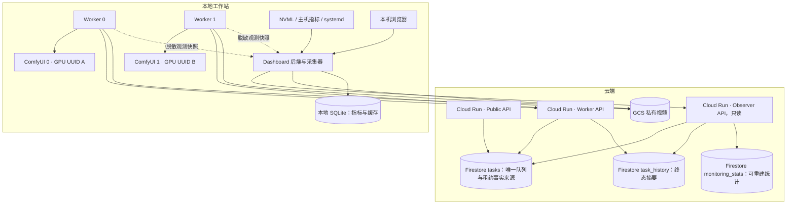

# Agent-Infra 本地监控面板设计

日期：2026-09-06。状态：设计草案，尚未实现。

本文是现有 V2.3 架构的监控扩展，执行架构以 [主设计](AI_STUDIO_MINIMAX_H3_API_HOSTING_PLAN_V2.md) 为准，部署现状见 [部署报告](DEPLOYMENT_REPORT_LOCAL.md)。本轮只编写设计，不修改运行代码或部署服务。STREAM 测试不属于本项目工作范围。

## 1. 目标与边界

在工作站浏览器打开一个页面，即可回答：机器是否健康、两张 GPU 各在执行什么、云端还有多少任务、任务卡在哪个阶段、生成速度是否下降、历史结果在哪里。

保留 Cloud Run 管理队列与租约、Firestore task 文档直接表示队列成员的设计。两张 RTX 5090 仍各自运行一个 worker 和一个 ComfyUI，每个 worker 只租一个完整任务，不预取、不共享任务。worker 空闲拉取与续租周期仍为 **1 秒**。

面板采用只读观测模式，第一版不提供提交、取消、重试、重启服务、修改 GPU 参数等操作。监控停止、浏览器关闭或本地监控数据库损坏，不能阻塞任务领取、推理、续租、上传或完成回报。

“本地面板”解释为仅监听 `127.0.0.1` 的浏览器界面。这是新增的本机访问入口，不开放公网或局域网端口，不部署 Tunnel；Cloud Run 也不回连工作站。现有 ComfyUI 保持 loopback 监听。

## 2. 总体架构



新增 `dashboard/`，使用独立虚拟环境和 systemd 用户服务。建议 FastAPI 后端、React + TypeScript 前端；前端构建后由后端同源提供，拟使用 `http://127.0.0.1:8765`。实施时确认端口空闲。硬件采集优先 NVML + psutil，前端图表使用轻量时间序列组件。

本地后端以 HTTPS 主动查询 Cloud Run，浏览器通过本地 SSE 接收快照变化。只有一个采集器，多个页面共享采样与云端缓存。SQLite 是监控缓存，不是第二套任务队列；本地不直接访问 Firestore。

## 3. 页面设计

### 3.1 总览

```text
Agent-Infra                         云端在线 / 本机正常 / 数据更新时间
时间范围：1h  24h  7d  自定义         最近告警：……

[Realtime 排队] [Batch 排队] [执行中 / 2] [成功率] [平均推理耗时]

┌ Worker 0 · GPU A ────────────┐ ┌ Worker 1 · GPU B ────────────┐
│ 服务健康 / 任务 ID / 阶段     │ │ 服务健康 / 任务 ID / 阶段     │
│ GPU 利用率 / 温度 / 功耗      │ │ GPU 利用率 / 温度 / 功耗      │
│ SM 时钟 / 已用与总显存        │ │ SM 时钟 / 已用与总显存        │
│ 运行耗时 / 最近续租 / 步数    │ │ 运行耗时 / 最近续租 / 步数    │
└──────────────────────────────┘ └──────────────────────────────┘

[CPU / 内存 / Swap / 磁盘 / 网络趋势]
[全队列] [历史任务] [视频库] [性能趋势] [健康事件]
```

所有数值带单位；异常标记同时有文字，不能只依赖颜色。GPU 通过 UUID 绑定 worker，序号仅用于显示，重启后不能因索引变化把两张卡的数据对调。

### 3.2 全队列

展示全部客户端的云端任务，默认显示 `queued / leased / running / uploading`，可按 realtime、batch、worker、状态筛选。列包含任务 ID、客户端标识、模式、创建时间、等待时间、worker、阶段、阶段持续时间、租约剩余时间。

Realtime 与 batch 分区展示，各按 `created_at, task_id` 升序。这个顺序反映候选顺序；事务竞争、实时任务新到达等因素使它不是承诺的开工顺序。显示排队数量、最老等待时间与软阈值，不能把软阈值画成不可超过的固定容量。

分页浏览完整队列，每页默认 50、最多 100 条，不把第一页称为“全部”。更新时保留用户正在阅读的页，并提示“有新变化”。实时汇总和分页列表可能采自不同时刻，分别标注更新时间。

### 3.3 任务详情与进度

详情展示云端真实调度状态、worker/GPU、模型与 workflow revision、seed、创建/领取/开始/上传/完成时间、耗时分解、错误码及结果。禁止返回 lease token、恢复凭证、完整 journal 或鉴权信息。

第一阶段显示可靠的粗粒度时间线：排队 → 已领取/准备 → 执行 → 上传 → 成功或失败，并显示已耗时。细分输入下载、模型加载、采样、编码需要新增观测事件，当前代码没有这些完整数据。

第二阶段由 worker 内的可选监听器接收 ComfyUI 执行事件，记录 `node_id、step、total_steps、observed_at`。监听器与当前提交的 client ID/prompt ID 对齐；dashboard 不冒用同一个 WebSocket client ID 建立竞争连接。断线时只重连观测，不能重提任务。实施前验证本机 ComfyUI 版本的事件及节点覆盖情况。

步数只表示当前采样节点进度，不是整个任务完成百分比。无法获取步数时显示“执行中，已耗时…”。恢复后的事件必须匹配 task、prompt 与当前执行会话；旧事件不覆盖新任务。预计剩余时间如后续加入，应标记为估计值，并在样本不足、冷启动或 revision 不匹配时隐藏。

### 3.4 历史任务与视频库

历史任务按完成时间倒序，支持时间、状态、模式、worker、revision 筛选和精确任务 ID 搜索。包含成功和失败任务，点击打开详情。第一版不做任意 prompt 全文搜索。

视频库只展示已验证成功的输出，提供按需播放、下载与复制 GCS 地址。永久定位信息是 `gs://bucket/object` 加 `gcs_generation`；它不是可以直接在普通浏览器播放的 HTTP 链接。

默认使用本地后端鉴权读取 GCS，再以支持 Range 的流式响应提供视频。路径为 `/api/tasks/{task_id}/video`，后端从云端可信结果解析 object 和 generation，禁止浏览器指定任意 bucket、路径或远程 URL。固定读取对应 generation，避免播放被替换的对象。GCS 凭证不进入浏览器。

“复制播放链接”得到仅当前工作站可用、需要本地会话的 URL；“复制 GCS 地址”用于长期定位。跨机器分享的短期签名 URL 可后续独立增加，不默认公开 bucket，不生成永不过期的公开链接。对象不存在、权限过期、网络错误分别显示，不把历史成功改成任务失败。

列表不自动下载全部视频；只有打开播放器后拉取媒体，关闭即取消请求，限制并发与缓冲。缩略图第一版可使用占位图，避免后台解码影响推理。

## 4. 数据来源与指标定义

| 范围 | 展示内容 | 数据来源与含义 |
|---|---|---|
| GPU | UUID、温度 °C、功耗 W / power limit、显存 MiB / 总量 | NVML；不支持的值显示 N/A |
| GPU 运算 | GPU 利用率 %、SM 时钟 MHz、显存时钟 | 利用率和时钟分列；不能把 MHz 标成利用率 |
| SM | 若设备支持，额外展示经验证的 SM 活跃度指标 | 第一版不承诺真实 SM occupancy；不支持时明确标注 |
| CPU | 总体及每核占用、load、温度（可用时） | psutil、系统传感器；load 不是百分比 |
| RAM | 总量、available、缓存、swap 使用与换入换出速率 | 避免把可回收缓存当作内存耗尽 |
| 磁盘 | worker 数据盘剩余空间、读写速率、IO 等待 | 系统计数器；磁盘不足对照 worker 最低空间要求 |
| 网络 | 收发速率、Cloud Run 请求延迟、失败次数 | 本地计数及采集器请求结果 |
| 服务 | 两个 worker、两个 ComfyUI 的 active 状态、PID、重启次数 | systemd + loopback ComfyUI 探测 |
| 云端 | API 可达性、Observer 读取结果、任务租约 | `/health` 只表示存活，不代表 Firestore 或整个链路健康 |

NVML 的 GPU utilization 表示采样周期内至少一个 kernel 执行的时间比例，不能等同于所有 SM 的占用程度。显存使用容量也不同于显存读写忙碌程度。参见 [NVIDIA NVML 定义](https://docs.nvidia.com/deploy/nvml-api/structnvmlUtilization__t.html)。

当前 worker 空闲时不持续上报云端 presence，`workers` 文档主要是任务分配锁，因此不能由“没有任务”推断 worker 离线。面板结合本地进程、ComfyUI 可达性、worker 最近一次成功拉取/续租的脱敏快照，分别显示“服务运行”“云端通信正常”“正在执行”。进程 active 但没有新观测时显示“状态待确认”。

### 4.1 耗时与成功率

当前 `metrics.inference_time_ms` 来自云端首次 running 至首次 uploading 的时间差，是执行阶段墙钟耗时，包含模型相关准备、推理及输出处理，不是纯 GPU kernel 时间；心跳边界也带来采样误差。当前 `queue_time_ms` 包含领取后准备时间，页面应标为“启动前等待”，不能直接标为纯排队。

新增版本化指标时区分：纯排队 `leased_at-created_at`、准备 `started_at-leased_at`、执行、上传、端到端；本地阶段持续时间使用单调时钟。恢复或缺失观测无法形成完整耗时的样本标记不完整，不能补零。保留 `metrics_version` 和 `metrics_source`，不同口径不混算。

默认统计最近 24 小时完成的任务，可切换 1 小时、7 天和自定义区间。平均执行耗时仅使用成功且计时有效的任务，必须同时显示样本数 N；另外展示 P50、P95、吞吐量与失败任务耗时。成功率 = 成功 /（成功 + 失败），不含进行中任务，无样本显示“—”。按 worker、模式、revision 和输出规格分组，冷启动样本在可识别时单独标记。

“执行中 / 2”包括 leased、running、uploading，即占用 worker 的任务数量；“GPU 正在计算”来自硬件指标，二者不混同。

## 5. 云端只读观测接口

现有 Public API 只有创建及单任务查询，且按 client 隔离，不能直接满足全局监控。新增 Observer API，由独立只读 observer 身份访问，权限可以覆盖整个部署；普通客户端和 worker key 不能调用。生产环境禁止无鉴权列表接口。

| 方法与路径（拟定） | 用途 |
|---|---|
| `GET /internal/observer/overview` | 按 mode/status 的数量、最老等待、活动任务摘要、数据采样时间 |
| `GET /internal/observer/tasks` | 活动队列分页与允许的筛选 |
| `GET /internal/observer/tasks/{task_id}` | 脱敏详情，先查在线任务，再查历史摘要 |
| `GET /internal/observer/history` | 按完成时间倒序的历史分页 |
| `GET /internal/observer/stats` | 指定窗口和允许分组的统计、样本量、统计更新时间 |

响应统一包含 `as_of`；统计还包含 `computed_through`、口径和是否近似。游标绑定排序与筛选，使用 task ID 作为相同时间的稳定排序键，拒绝非法/过期游标。跨请求不保证数据库冻结快照，前端按 task ID 去重；明确显示分页期间状态可能变化。

接口提供显式字段白名单，不直接序列化 Firestore 文档。为有限筛选组合增加复合索引，不允许任意字段查询或无界扫描。Overview 不逐条读取所有历史任务；活动数量使用聚合查询，活动详情分页读取。可短时缓存并限制 observer 请求速率；Cloud Run 多实例各有缓存，不依赖进程内缓存保证正确性。

## 6. 历史持久化与统计

当前 `tasks` 终态文档设置 7 天 TTL，不能满足长期历史。建议新增 `task_history/{task_id}`，默认保留 **90 天，可配置**，保留窗口内的全客户端历史；现有 task TTL 和 GCS 视频保留策略保持原样。90 天是本设计默认值，界面显示覆盖时间，不宣称永久历史。

在进入成功或失败终态的原事务中写入一份大小受限、白名单化的历史摘要，覆盖 complete、fail、租约/总时限过期等所有终态入口。使用相同 task ID，使回报重放不会产生重复历史。摘要只包含任务展示字段、worker、revision、时间、指标、错误码及已验证的输出定位信息，不含租约凭证、完整输入 URL 或原始异常文本。

这增加一次持久化写入，必须纳入终态事务的兼容性和失败测试；仪表盘、聚合器、NVML、SQLite 均不参与该事务。历史缺失字段按版本兼容，不能因前端可选字段校验阻塞完成回报。

统计由独立维护任务增量计算，按时间桶与允许维度存储到 `monitoring_stats`。采用可重试且幂等的 checkpoint/去重机制，并重算近期窗口处理延迟写入。平均值存 sum/count；P50/P95 使用明确标注的直方图近似，不平均多个分位数。任意时间范围按边界桶处理并返回实际覆盖范围，不能悄悄包含区间外数据。聚合滞后时显示滞后状态，不能把缺失数据当成零。

上线时幂等回填尚未被 TTL 删除的终态任务。已经删除的任务不能完整恢复；GCS 元数据最多提供部分输出信息，若后续回填，必须标记“仅视频记录，任务详情缺失”，不计入耗时统计。

TTL 不是精确时间删除，查询需按逻辑保留期过滤已过期记录，不能依赖后台删除时刻。参见 [Firestore TTL 文档](https://firebase.google.com/docs/firestore/ttl)。

本地硬件指标保留：1 秒粒度 24 小时、1 分钟聚合 30 天；聚合保留均值和峰值。SQLite 单写入器、批量写入、滚动清理，设置磁盘上限；写入失败时退化为内存实时快照并告警。任务历史事实来源仍在云端。

## 7. 刷新、隔离与安全

| 数据 | 建议周期 |
|---|---|
| GPU / CPU / RAM / 本地任务快照 | 1 秒 |
| systemd / ComfyUI 健康 | 5 秒 |
| 云端活动队列与 overview | 页面活跃时 2 秒；无页面时 15 秒 |
| 历史列表 | 打开、翻页、手动刷新；首屏可每 15 秒刷新 |
| 聚合统计 | 前端 15 秒读取；云端约每分钟计算 |

这是监控刷新频率，不改变 worker 的 1 秒拉取/续租。所有采集有超时、禁止重叠积压、失败指数退避并带抖动。浏览器只订阅本地快照；SSE 重连先返回完整快照。云端断网时本地 GPU 图继续更新，队列显示最后快照和“已过期”，不能显示成空队列。

每类数据携带采样时间和来源。超过其预期周期 3 倍未更新即标 stale；硬件读取失败显示 N/A。租约剩余时间参考服务器时间偏移，仅用于展示，失效判定始终由云端负责。

监控使用独立 Python 环境，不导入 torch 或载入模型；systemd 服务单独设资源限制和重启策略，不与 worker 建立停止联动。worker 写入脱敏遥测采用有界、尽力而为的非阻塞路径，失败不能传播到执行和续租线程。原始 `state/active.json` 不作为浏览器数据源。

Observer 凭证仅保存在本地后端私有配置中，云端独立验证和轮换。视频读取使用独立只读 GCS 身份，权限限制到生成目录，不复用 uploader 写入权限，不创建 service account 静态私钥。沿用可用的无密钥身份机制；令牌刷新失败时仅媒体功能降级，页面明确提示重新认证。

本地服务限定 loopback、校验 Host/Origin、禁止宽松 CORS；使用短期一次性启动凭证换取 HttpOnly/SameSite 本地会话，启动凭证私有保存且不记录到日志。浏览器不持有云端密钥。视频与 SSE 同样要求本地会话，防止其他网站通过用户浏览器读取本机监控信息。日志只读取允许的四个服务，按需分页、限制大小并脱敏，不支持任意 shell 命令。

## 8. 健康判断与告警

健康状态分为正常、警告、故障、未知，并分别显示本机、worker、云端和存储链路。故障旁直接展示最近成功时间及证据，不能用一个绿色 `/health` 掩盖依赖故障。

第一版页面内告警：worker/ComfyUI 停止或反复重启、GPU UUID 缺失、温度持续越过可配置阈值、系统可用内存低并持续换页、数据盘低于 worker 要求、云端通信失败、活动任务长时间无新观测、租约接近过期、失败率上升。

温度阈值实施时结合设备返回的限制与实际运行基线设定，不把任意固定温度称为厂商安全上限。高显存占用、GPU 暂时空闲、模型常驻内存本身不代表故障。告警需持续窗口、恢复窗口和去重；任务观察到停滞只提示，不自动打断或重派。首次版本不向外部聊天或邮件发送消息。

## 9. 代码组织与实施顺序

```text
cloudrun/
  observer_api.py         # 新增，只读 API 与身份校验
  monitoring_store.py     # 新增，历史查询、聚合读取
  ...                    # 终态摘要持久化、维护任务、索引扩展
worker/
  telemetry.py           # 新增，可选脱敏快照与进度观测
  ...                    # 现有执行与租约机制保留
dashboard/
  backend/               # 本地 API、SSE、鉴权、视频代理
  collectors/            # NVML、主机、systemd、云端采集
  frontend/              # 页面与图表
  deploy/                # 配置示例、systemd 用户服务
  tests/
```

1. **数据基础**：增加 observer 鉴权、全队列分页、历史摘要与回填、统计定义和必要索引；测试全部终态入口与权限边界。
2. **可用面板**：实现本机健康、两张 GPU 卡片、云端队列、粗阶段进度、历史任务、统计和按需视频播放。部署独立本地服务。
3. **进度增强与稳定性**：加入可选 ComfyUI 事件观测、阶段细分、告警及趋势保留；完成断网、恢复、资源上限和长时间运行验证。

三个阶段合起来覆盖本需求；阶段二已有可用界面，不能把它表述为细粒度进度已全部完成。先在模拟数据、Firestore emulator 和本地测试中验证，再增量部署云端和本地。若需更新 worker，逐个在空闲时滚动，保持已有恢复语义；不为部署监控主动中断运行任务。

## 10. 验收标准

- 浏览器只访问 loopback；外部无法连接本地面板。Cloud Run 的普通客户端不能读取全局队列。
- 两张 GPU 的 UUID、温度、功耗、利用率、SM 时钟、显存能与本机工具交叉核对；不支持的指标不伪造为零。
- 队列覆盖所有客户端和两种模式；超过一页仍能浏览全部任务；领取、执行、上传、终态变化正确显示。
- 两个并行任务分别关联正确的 worker/GPU；恢复过程没有重复任务、错误串联或旧进度覆盖。
- 统计用已知时间样本验证平均值、样本数、成功率与窗口边界；新旧指标口径不混用，分位数注明近似。
- 历史覆盖所有终态路径及幂等重放；在线 task 清理后仍可读取保留期内摘要与对应 generation 的视频。
- 播放支持拖动，媒体失效/权限错误可理解；响应、日志和前端存储中无 worker key、lease token 或 GCP 凭证。
- 断开云端、停止面板、模拟 NVML 失败和 SQLite 写入失败时，任务执行与 1 秒续租不受监控故障影响。
- 连续运行 24 小时观察 CPU/RAM/磁盘开销，并与面板关闭时对照双 GPU 推理耗时；若监控造成可重复的明显退化，降低采集成本后再验收。

以上端口、90 天历史保留期、刷新频率和只读操作范围是本设计建议默认值；本文件不代表这些功能已实现或已部署。
